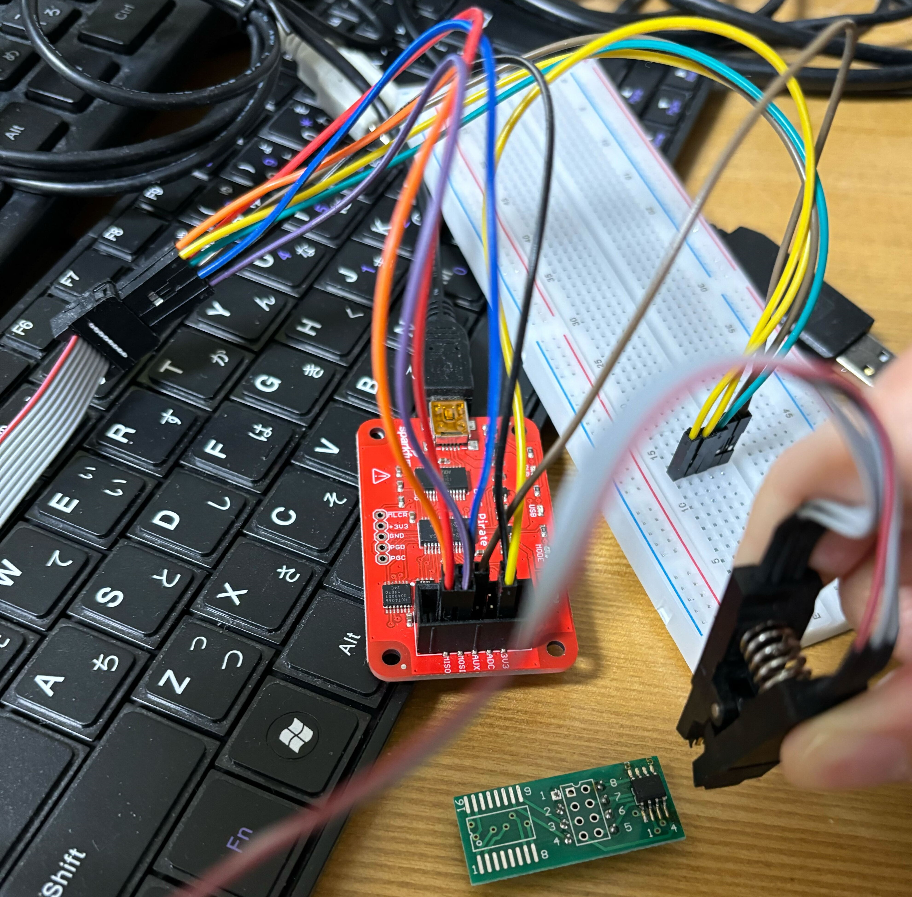
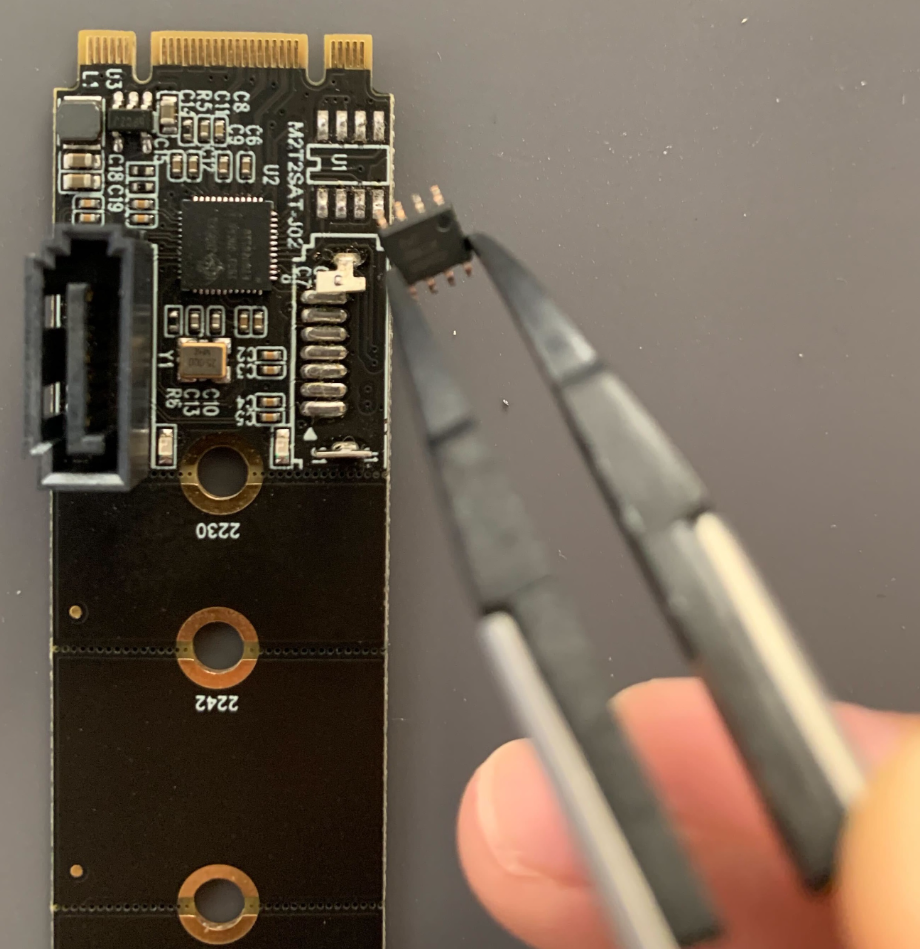

# OROM Flasher
**Tool for flashing SPI flash (OROM of the external device) using BusPirate**.  
There are various readers out there that can read the contents of ROMs including SPI flash chips, but each reader has limitations of the flash chip model it supports.
From my own experiences, the model of the flash chip that the OROM images are contained in tends to be unsupported by commercial ROM reader/writer.  
> [!IMPORTANT]  
> - Although SPI flash specifications have many things in common, the specifications differ depending on the model, so be sure to **check your flash chip specifications before using this tool and modify it if needed**.
> - This tool assumes the OROM of the device is contained in an SPI flash chip, but it maybe contained in different kinds of ROMs

> [!NOTE]  
> This tool's default setting is for writing OROM of [this SATA adapter](https://www.amazon.co.jp/gp/product/B0B14V753G/ref=ppx_yo_dt_b_asin_title_o00_s00?ie=UTF8&th=1) which has the SPI flash chip of model [uc25hq40](http://www.ucuntech.com/uploads/20220324/3f2b6d316359978e2fd7954a127893e8.pdf).


## Setup
Connect the host PC and the target device with BusPirate as shown below. Check the pin specifications of the flash chip to see which pins correspond to which.  

  


## Usage
Make sure pyserial is installed (`pip install pyserial`).
```
python orom-flasher.py [options] -f hoge.bin

[options]
	-p comN, --port comN
		Serial port name where BusPirate is connected (default='com4')
	-b 115200, --baud 115200	
		Baudrate of BusPirate (default=115200)
	-a 0x000C00, --addr 0x000C00
		Address of the flash chip to start writing (refer to below subsection)
	-s 0x100, --pagesize 0x100
		Page size of the flash chip (refer flash chip manual)
```

### How to find the address of the flash chip where OROM image is located?
1. Dump the contents of the SPI flash chip using equipment such as BusPirate.
1. Search for the OROM signature (`55 AA`) in the dump file and check the offset of it.
	* To confirm that it is OROM image, there should be EFI image header signature (`0x0EF1`) two byte after the OROM signature (`55 AA XX XX F1 0E`).

### How to reset BusPirate when your python program showed error
You can use escape Raw SPI mode or bitbang mode using bp-reset.py.
```
python bp-reset.py [options]

[options]
	-p comN, --port comN
		Serial port name where BusPirate is connected (defaut='com4')
	-b 115200, --baud 115200	
		Baudrate of BusPirate (default=115200)
```


## Detail
This tool uses BusPirate's [Raw SPI Mode](http://dangerousprototypes.com/blog/2009/10/08/bus-pirate-raw-spi-mode/) to communicate with SPI flash chip.
Communication between python and BusPirate is done by pyserial.

### pyserial usage
````python
port = serial.Serial(args.port, args.baud, timeout=0.1)
port.write(b'\xFF')
data = port.read(4)
````

### Enter Raw SPI Mode
* Input `0x00` 20 times to enter bitbang mode (BusPirate will return `BBIO1`)
* Input `0x01` in bitbang mode to enter Raw SPI mode (BusPirate will return `SPI1`)
* (Input `0x0F` in bitbang mode to reset BusPirate)

### Commands in Raw SPI Mode
* `0b00000000`: Return to bitbang mode
* `0b0000001x`: CS high (1) or low (0)
* `0b0001xxxx`: Send `xxxx+1` bytes data to BusPirate (Use this to send arbitrary SPI commands to the flash)
* Configuration
	* `0b0100wxyz`: w=power, x=pull-ups, y=AUX, z=CS (enable (1)、disable (0))
	* `0b01100xxx`: 000=30kHz, 001=125kHz, 010=250kHz, 011=1MHz, 100=2MHz, 101=2.6MHz, 110=4MHz, 111=8MHz
	* `0b1000wxyz`: w=HiZ(0)/3.3v(1), x=CKP idle(low=0), y=CKE edge(active to idle=1), z=SMP sample (middle=0)


## Troubleshooting
* All data is `0x00`: Connection problem
* All data is `0xFF`: Where you're reading is empty
* Unstable data: The BusPirate power supply may also be supplied to a microcontroller or other device, causing interference with access. In this case, you will need to melt the solder with a heat gun or similar, remove it, and then write to the data, as shown in the figure below.

